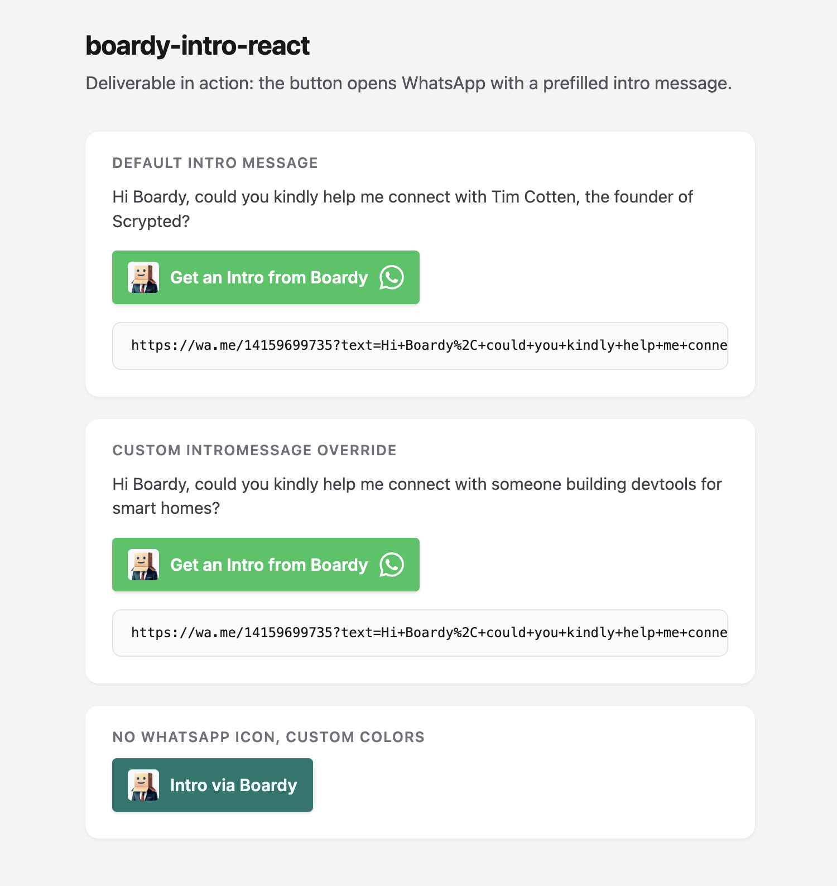

# boardyai-cta

A small **React** control that turns your homepage into a warm handoff: one click opens **WhatsApp** with a prefilled message to [**Boardy**](https://www.boardy.ai), so visitors ask for an intro *through Boardy* instead of guessing your inbox or sending a context-free cold email. Boardy already knows how to route people; your site just states who they want to reach and why it matters.



## Why this exists

Cold emails from your landing page are easy to ignore. A **Boardy-mediated intro** keeps the request in a channel Boardy is built for and carries a clearer ask. This repo packages that flow as a drop-in button for React sites.

> **Not official Boardy software.** Community contribution. Boardy’s name, imagery, and trademarks belong to Boardy; see [LICENSE](LICENSE).

## Packages

| Package | Description |
|--------|-------------|
| [`boardy-intro-react`](packages/boardy-intro-react) | Embeddable `BoardyIntroButton` component |

## Install

From another project in the same monorepo, or after cloning this repo:

```bash
npm install ./path/to/boardyai/packages/boardy-intro-react
```

Build the library first:

```bash
npm run build -w boardy-intro-react
```

Requires **React 17+** as a peer dependency.

## Usage

Import the component and its stylesheet (bundlers such as Vite or Webpack will include the CSS).

```tsx
import { BoardyIntroButton } from "boardy-intro-react";
import "boardy-intro-react/style.css";

export function Hero() {
  return (
    <BoardyIntroButton
      introMessage="Hi Boardy, could you kindly help me connect with [you] about [topic]?"
    />
  );
}
```

The link target is `https://wa.me/<phone>?text=<encoded message>` (default phone matches Boardy’s public WhatsApp line used on [boardy.ai](https://www.boardy.ai)).

### Props

| Prop | Default | Description |
|------|---------|-------------|
| `introMessage` | *(see package default)* | Full text sent as the WhatsApp `text` query parameter. **Set this** for your site so the ask is about you, not the package author. |
| `phoneNumber` | `14159699735` | E.164 digits without `+`; override only if you know a different Boardy routing number. |
| `label` | `Get an Intro from Boardy` | Visible button label. |
| `backgroundColor` | `#22c55e` | Button background. |
| `textColor` | `#ffffff` | Label and icon color. |
| `showWhatsAppIcon` | `true` | Show the chat glyph on the right. |
| `boardyIconSrc` | Boardy profile image URL | Replace if you host your own asset (rights remain with Boardy). |
| `className`, `style` | (n/a) | Passed through to the outer `<a>`. |

## Monorepo scripts

```bash
npm install
npm run build              # build boardy-intro-react
npm run dev:demo           # build library + Vite demo app
```

The demo lives under `packages/boardy-intro-demo`.

## License

MIT. Includes a **trademark notice** for Boardy and WhatsApp / Meta in [LICENSE](LICENSE).
